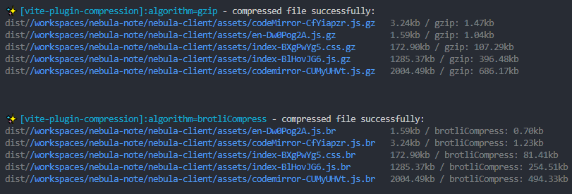
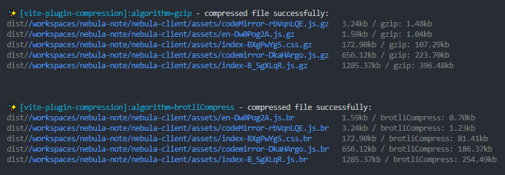
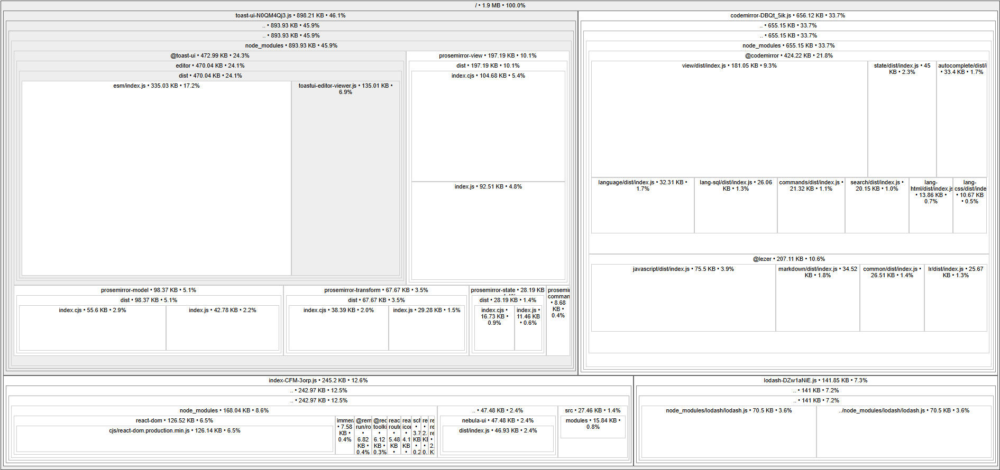
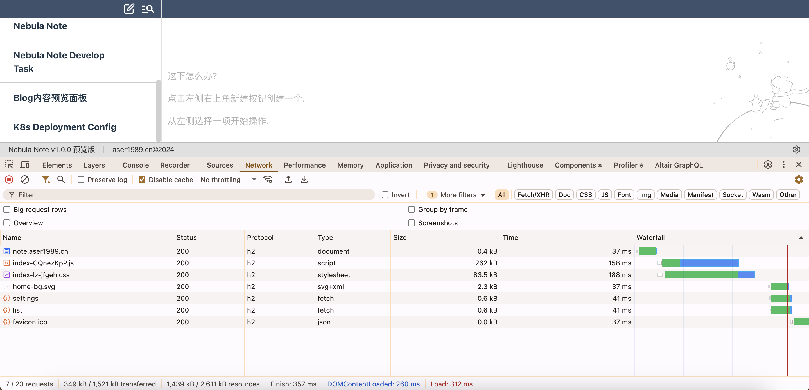
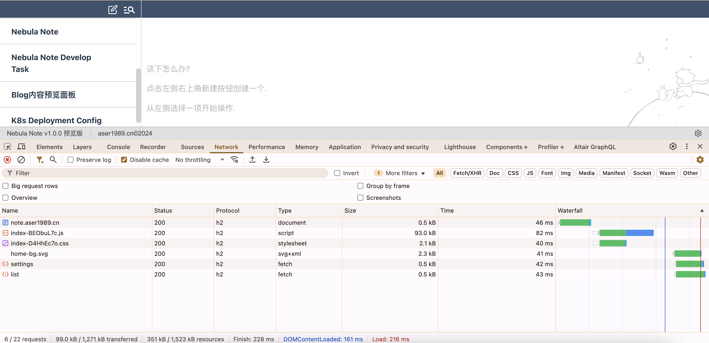

前不久发布了个人笔记软件 **`Nebula Note`** 的Web预览版([传送门](https://note.aser1989.cn))，整体开发体验和使用效果都很满意。但作为Web工程师的我习惯性的打开了浏览器开发者工具的Network面板，主要想观察首次加载时间。2 秒+！显然，这个加载速度无法接受。于是便开始了一轮深入优化，目标是：将首页加载时间控制在 1 秒内，真正的实现秒开。

<!-- truncate -->

## 性能瓶颈分析

从浏览器开发者工具的Network面板上可以很明显的观察到是首屏资源体积过大所致。项目技术栈为：

- 前端框架：`React`
- 服务端框架：`NodeJs`、`Koa`
- 构建工具：`Vite`
- UI 组件：自研的 [Nebula UI](https://ui.aser1989.cn/)，由于功能过于简单，所以没有用主流的UI库。

排除自研代码后，问题可能出在集成的第三方组件上。使用打包分析工具检查产物体积，结果如下：

- `react-codemirror`在线代码编辑器：体积最大
- `toast-ui` Markdown 编辑器：第二大
-  自研逻辑：占比极小

使用`source-map-explorer`对构架结果进行分析，截图如下：


## 基础优化：开启 Brotli 压缩

当前服务部署在 [99 元云服务器](/blog/k3s-ci-cd) 上的 Kubernetes 环境中，所有服务通过自定义模板的 Deployment 文件部署（[配置传送门](https://note.aser1989.cn/K8s%20Deployment%20Config)），IngressRoute 中默认启用了Gzip 压缩。Gzip还是有点温柔，考虑进一步压榨传输体积，于是启用了Brotli压缩。构建结果对比测试效果如下：



Brotli的实力毋庸置疑，比Gzip多压缩了近200KB。而且这次是在打包的时候就对资源进行了压缩，理论上应该能有效缩减服务器的响应时间。但即便如此页面加载时间仍未突破 1 秒。


## 深度优化：移除冗余语言包（AST静态裁剪）

根据打包分析结果，`react-codemirror` 是最大“重量级选手”。主要原因是其默认引入了大量编程语言的语法高亮支持，而目前 `Nebula Note` 实际仅使用少数几种。因此，静态分析源码后，通过自定义 Vite 插件在构建阶段识别未使用的语言包，然后再利用 AST（抽象语法树）移除无关代码，最后打包体积减少1MB+。效果是相当的炸裂。优化后打包体积对比图如下：



构建分析结果：



此轮优化后`react-codemirror` 从第一名降至第二，首屏加载时间也成功挤进 1 秒以内。最终成果如下：




## 更近一步：延迟加载非首屏组件

虽然“秒开”目标已实现，但从打包占比来看 `react-codemirror` 与 `toast-ui` 两大组件仍占据 **近 80%** 体积，并且这两个包在第一屏中是非必需的，或只需其一。于是采用 `React` 的 `Suspense` + `lazy` 机制，针对这两个组件实现延迟加载：

```tsx
import React, { Suspense, lazy } from 'react';
import SuspenseLoading from '@client/components/suspenseLoading';
import type { Props as IProps } from './codeMirror';

const Editor = lazy(() => import('./codeMirror'));

export type Props = IProps;
const CodeEditor = (props: IProps) => {
    return (
        <Suspense fallback={<SuspenseLoading />}>
            <Editor {...props} />
        </Suspense>
    );
};
export default CodeEditor;

```



使用`Suspense`后，懒加载的模块在构建的时候会被拆成独立的包，这对于首屏的加载非常的友好。通过对比可以看到不仅是`JS`文件从262KB降到了93KB，首次加载的`CSS`文件更是从83.5KB降到了2.1KB。


## 最后
有一个很奇怪的现象，`CSS`的TTFB很不稳定，在约40ms和100ms间反复横跳。其他资源，尤其是Http请求相关的资源表现很稳定。有知道原因的朋友，还请在评论区分享一下。最后附上博客所述内容资源，欢迎点赞支持～✌️。

Nebula Note预览版：[https://note.aser1989.cn/](https://note.aser1989.cn)  
Nebula Note源代码: [https://github.com/ASER1989/nebula-note](https://github.com/ASER1989/nebula-note)

---

Posted on [Aser1989’s](https://www.cnblogs.com/aser1989) cnblogs on June, 2025
