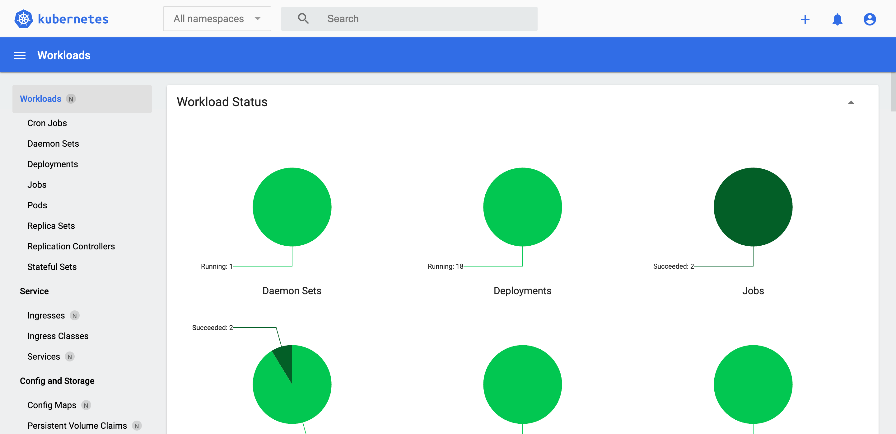

# 安装K8s Dashboard


K8s Dashboard是一个Web UI工具，主要用于管理K8s集群中的资源和应用程序。它提供了一个用户友好的界面，使得用户可以更方便地查看和操作K8s集群中的各种资源，比如Pods、Services、Deployments等。其实一定程度上讲，我是不需要它的，毕竟在此之前很长一段时间都没有使用它。但无论如何，UI的便捷性是远胜于命令行的。

## 嘈点
+ 登陆比较尴尬，要么用token，要么是kubeconfig文件。token是临时的，kubeconfig文件是静态的，不能动态更新。使用起来没有用户名密码那么方便。
+ Kubernetes Dashboard 默认使用自签名证书与 API Server 进行 HTTPS 通信，这会导致浏览器提示安全警告。虽然可选择为 API Server 配置受信任证书，但操作更复杂，适合有经验的集群管理员。（文档中使用Traefik配置 Let‘s Encrypt 签发的证书，实现外部 TLS 终止）

## 安装
kubectl安装，也可以下载yaml文件直接安装
```sh
kubectl apply -f https://raw.githubusercontent.com/kubernetes/dashboard/v2.7.0/aio/deploy/recommended.yaml
```
## 添加IngressRoute
在应用访问这件事上，还是喜欢通过域名访问，所以Ingress一定不能少：

```yaml
# dashboard-ingress.yaml
apiVersion: traefik.containo.us/v1alpha1
kind: ServersTransport
metadata:
  name: insecure-skip-verify
  namespace: kubernetes-dashboard
spec:
  insecureSkipVerify: true

---
apiVersion: traefik.containo.us/v1alpha1
kind: IngressRoute
metadata:
  name: dashboard-ingress
  namespace: kubernetes-dashboard
  annotations:
    cert-manager.io/cluster-issuer: letsencrypt-production # 注意这里使用了lets encrypt的证书
spec:
  entryPoints:
    - websecure
  routes:
    - match: Host(`k8s.domain.com`) # 这里需要替换成自己的域名
      kind: Rule
      services:
        - name: kubernetes-dashboard
          port: 443
          scheme: https
          serversTransport: insecure-skip-verify # 这里需要注意，k8s-dashboard的服务是443端口
  tls:
    secretName: k8s-dashboard-letsencrypt-tls
```
应用
```sh
kubectl apply -f dashboard-ingress.yaml
```
:::warning
在 Traefik 作为反向代理访问 Kubernetes Dashboard 时，由于 Dashboard 使用的是自签名证书，Traefik 默认会验证其 TLS 证书，导致握手失败（提示 “tls: bad certificate”）。解决办法是配置 ServersTransport 并设置 insecureSkipVerify: true，让 Traefik 信任该自签名证书。
:::


## 创建访问权限
Kubernetes Dashboard 需要足够的权限才能够访问所有资源，所以需要为其创建一个 ServiceAccount 和 ClusterRoleBinding，以便授予必要的权限。
创建一个名为 admin-user 的用户，并授予集群管理员权限：
```yaml
# admin-user.yaml
apiVersion: v1
kind: ServiceAccount
metadata:
  name: admin-user
  namespace: kubernetes-dashboard

---
apiVersion: rbac.authorization.k8s.io/v1
kind: ClusterRoleBinding
metadata:
  name: admin-user
roleRef:
  apiGroup: rbac.authorization.k8s.io
  kind: ClusterRole
  name: cluster-admin
subjects:
  - kind: ServiceAccount
    name: admin-user
    namespace: kubernetes-dashboard
```
应用
```sh
kubectl apply -f admin-user.yaml
```

## 获取token
获取 admin-user 的 token：
```sh
kubectl -n kubernetes-dashboard create token admin-user
```

## 最后：访问Dashboard
选择token登录，粘贴上面获取的token，点击登录即可。


## 意料之外
也许是因为 cert-manager 创建的 Certificate 资源没有成功完成与 Let’s Encrypt 的交互，导致 TLS 证书未生成，Ingress 无法使用，最终 Traefik 退回使用默认证书。
### 排查
**运行以下命令查看证书状态：**
```sh
kubectl describe certificate k8s-dashboard-letsencrypt-tls -n kubernetes-dashboard
```

如果证书状态为 `Ready: False`，则表示证书未成功生成。可以查看事件（Events）部分，了解失败的原因。

**查看证书是否正常生成:**
```sh
kubectl get secret -n kubernetes-dashboard
```
看看是否有一个叫 k8s-dashboard-letsencrypt-tls 的 Secret，类型应为 kubernetes.io/tls。

### 解决：手动创建一个 Certificate 资源
如果证书不存在，可以手动为 Traefik 使用的域名创建一个 Certificate 资源，示例如下：
```yaml
# certificate.yaml

apiVersion: cert-manager.io/v1
kind: Certificate
metadata:
  name: k8s-dashboard-letsencrypt-tls
  namespace: kubernetes-dashboard
spec:
  secretName: k8s-dashboard-letsencrypt-tls
  issuerRef:
    name: letsencrypt-production
    kind: ClusterIssuer
  commonName: k8s.domain.com
  dnsNames:
    - k8s.domain.com
```
应用
```sh
kubectl apply -f certificate.yaml
```
:::tip
注意 k8s.domain.com 需要替换为dashboard的域名
:::


### 参考资料
[1 . 部署和访问 Kubernetes 仪表板](https://kubernetes.io/zh-cn/docs/tasks/access-application-cluster/web-ui-dashboard/) <br/>
[2 . 安装 Kubernetes Dashboard](https://todoit.tech/k8s/dashboard/)
