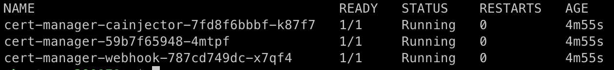
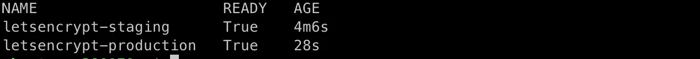

# Let’s Encrypt 配置
Let’s Encrypt提供了免费的SSL证书，可以为网站启用HTTPS。K3s默认使用Traefik作为Ingress Controller，Traefik支持自动为网站生成Let’s Encrypt证书。启用HTTPS是开启H2协议的前提条件。当前文档内容整理自一篇国外博客。

## Installation
``` sh
kubectl apply -f https://github.com/jetstack/cert-manager/releases/download/v1.7.3/cert-manager.yaml
```

**Verify the cert manager installation**
```
kubectl -n cert-manager get pod
```



## Create the ClusterIssuer resource
Create ClusterIssuer for staging environment
``` yaml
# cluster-issuer-staging.yaml

apiVersion: cert-manager.io/v1
kind: ClusterIssuer
metadata:
  name: letsencrypt-staging
  namespace: default
spec:
  acme:
    server: https://acme-staging-v02.api.letsencrypt.org/directory
    email: <YOUR_EMAIL> # replace for your valid email
    privateKeySecretRef:
      name: letsencrypt-staging
    solvers:
    - selector: {}
      http01:
        ingress:
          class: traefik
```

``` sh
kubectl apply -f cluster-issuer-staging.yaml
```

Create ClusterIssuer for production environment

``` yaml
# cluster-issuer-production.yaml

apiVersion: cert-manager.io/v1
kind: ClusterIssuer
metadata:
  name: letsencrypt-production
  namespace: default
spec:
  acme:
    server: https://acme-v02.api.letsencrypt.org/directory
    email: <YOUR_EMAIL> # replace for your valid email
    privateKeySecretRef:
      name: letsencrypt-production
    solvers:
    - selector: {}
      http01:
        ingress:
          class: traefik
```

``` sh
kubectl apply -f cluster-issuer-production.yaml
```

**Verify that it has been properly applied**
``` sh
kubectl get ClusterIssuer -A
```



## Let’s play!
Finally we are going to create our certificate
**Create a ingress traefik controller**
Define the*trafik*ingress with the*cert-manager*annotations and the*tsl*section to be able to manage our certificate.

**Eg**:
``` yaml
# ingress ingress-nginx.yaml

apiVersion: networking.k8s.io/v1
kind: Ingress
metadata:
  annotations:
    cert-manager.io/cluster-issuer: letsencrypt-production
    kubernetes.io/ingress.class: traefik
  labels:
    app: nginx
  name: nginx
  namespace: default
spec:
  rules:
  - host: example.com # Change by your domain
    http:
      paths:
      - backend:
          service:
            name: nginx
            port: 
              number: 80
        path: /
        pathType: Prefix  
  tls:
  - hosts:
    - example.com # Change by your domain
    secretName: example-com-tls
```

``` sh
kubectl apply -f ingress-nginx.yaml
```

You can show the valid certificated by Let’s Encrypt!

## Conclusion
Once you have installed cert manager it is really easy to manage your certificates together with traefik. You just have to set a couple of parameters in the ingress and the system takes care of everything.
No more excuses for not using a valid certificate!


## Reference
[Easy steps to install K3s with SSL certificate by traefik, cert manager and Let’s Encrypt](https://levelup.gitconnected.com/easy-steps-to-install-k3s-with-ssl-certificate-by-traefik-cert-manager-and-lets-encrypt-d74947fe7a8)
