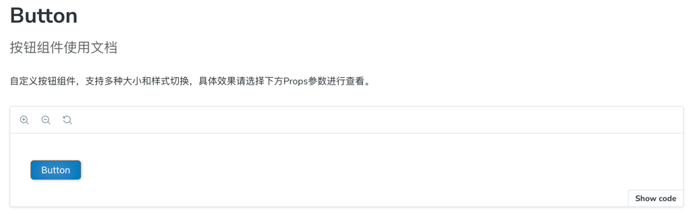
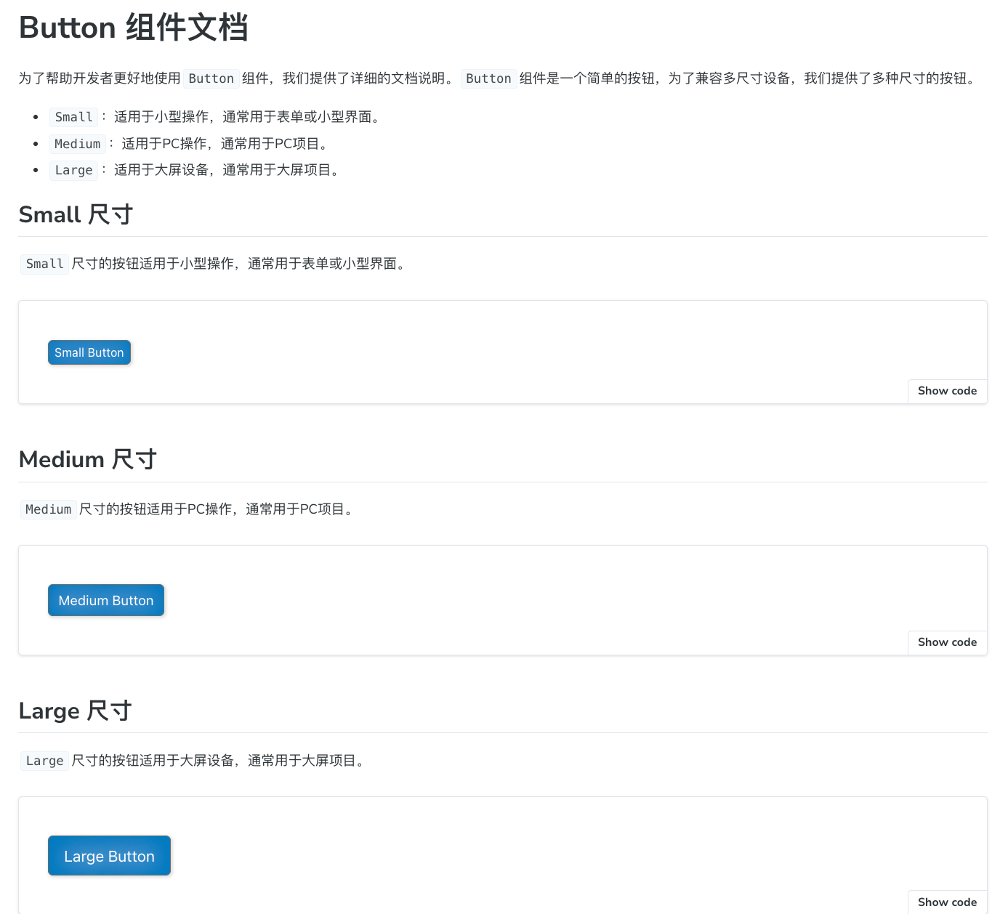

# 如何添加说明文档

:::warning
文档内容基于 Storybook 8.6 版本的特性和功能编写，所提供示例代码为 React 或 Typescript内容。
:::
每一段文字，都是与时间对话的桥梁，承载着智慧与经验的传承。

在`Storybook`中， 有两种方式可以为文档添加丰富的图文介绍：

+ 使用`Autodocs`自动生成的基础模板,通过Meta配置的`parameters.docs`属性，为组件添加介绍内容；
+ 使用`MDX`为每个组件创建自定义的文档页面。

## Autodocs
`Autodocs`是`Storybook`的一个功能，它通过读取`Meta`中`parameters.docs`属性内容自动生成组件文档。属性内容请参考：
[附：parameters.docs属性介绍](#附)。
### 文件目录

```text
components/
├─ Button/
│  ├─ Button.tsx
│  ├─ Button.stories.tsx
```
### 组件代码
Button.tsx组件代码如下：
```typescript
type ButtonProps = {
  /** 按钮文字 */
  label: string;
  /** 按钮是否禁用 */
  disabled?: boolean;
  /** 按钮大小 */
  size?: 'small' | 'medium' | 'large';
};

const Button = ({ label, disabled, size }: ButtonProps) => (
  <button disabled={disabled} className={`btn-${size}`}>
    {label}
  </button>
);

export default Button;
```
### Story代码
Button.stories.tsx内容如下：
```typescript
import type { Meta, StoryObj } from '@storybook/react';
import Button from './Button';
import type ButtonProps from './Button';

export default {
  title: 'Components/Button',
  component: Button,
  tags: ['autodocs'],
  parameters: {
    docs: {
      subtitle: '按钮组件使用文档',
      description: {
        component: '自定义按钮组件，支持多种大小和样式切换，具体效果请选择下方Props参数进行查看。',
      },
    },
  }
} as Meta<ButtonProps>;

type Story = StoryObj<typeof ButtonProps>;
export const Primary: Story = {};
```

### 运行效果
<div style={{border: "solid 1px #c0c0c0", padding: 10, borderRadius: 3}}>
  
</div>

`Autodocs`使用起来会比较方便，但是对于一些复杂的组件，`Autodocs`生成的文档内容可能不够完善，这时候就可以使用`MDX`为每个组件创建自定义的文档页面。

## MDX
`MDX`是`Storybook`的一个功能，它允许我们在文档中使用`Markdown`和`JSX`，从而可以更灵活地创建组件文档。通过`MDX`，我们可以在文档中嵌入组件、添加交互式示例、使用自定义布局等。
### 文件目录
```mdxjsx
components/
├─ Button/
│  ├─ Button.tsx
│  ├─ Button.stories.tsx
│  ├─ Button.mdx
```

### Story代码

Button.stories.tsx内容如下：
```typescript jsx
import type { Meta, StoryObj } from '@storybook/react';
import Button from './Button';
import type ButtonProps from './Button';

export default {
  title: 'Components/Button',
  component: Button
} as Meta<ButtonProps>;

export type Story = StoryObj<ButtonProps>;
export const Primary: Story = {
    name:'Primary',
    args: {
        children: 'Small Button',
        size: 'small',
    },
}
export const Medium: Story = {
    name:'Medium',
    args: {
        children: 'Medium Button',
        size: 'medium',
    },
};

export const Large: Story = {
    args: {
        children: 'Large Button',
        size: 'large',
    },
}

```
### 详细文档

在Button.mdx中添加如下内容：
```markdown
import { ArgTypes, Canvas, Meta } from '@storybook/addon-docs';
import Button, { Primary,Medium, Large} from './index.stories';

<Meta of={Button} />

# Button 组件文档
为了帮助开发者更好地使用`Button`组件，我们提供了详细的文档说明。`Button`组件是一个简单的按钮，为了兼容多尺寸设备，我们提供了多种尺寸的按钮。
+ `Small`：适用于小型操作，通常用于表单或小型界面。
+ `Medium`：适用于PC操作，通常用于PC项目。
+ `Large`：适用于大屏设备，通常用于大屏项目。

## Small 尺寸
`Small`尺寸的按钮适用于小型操作，通常用于表单或小型界面。
<Canvas of={Primary} />

## Medium 尺寸
`Medium`尺寸的按钮适用于PC操作，通常用于PC项目。
<Canvas of={Medium}/>

## Large 尺寸
`Large`尺寸的按钮适用于大屏设备，通常用于大屏项目。
<Canvas of={Large}/>

## Props
<ArgTypes />

```

:::info
Meta 块用于定义文档在侧边栏中的位置。在这个例子中，它被放置在 Checkbox 的故事旁边。默认情况下，文档的侧边栏节点标题为 “Docs”，但可以通过传递 name 属性进行自定义（例如：\<Meta of=\{CheckboxStories\} name="Info"\/> ）。如果你希望将文档节点放置在导航层级中的任意位置，可以使用 title 属性（例如：\<Meta title="path/to/node"\/> ）。
:::

运行效果：
<div style={{border: "solid 1px #c0c0c0", padding: 10, borderRadius: 3}}>
  
</div>

在`MDX`中，我们可以使用`Canvas`组件来嵌入故事（Story），并通过`of`属性指定要渲染的故事。我们还可以使用`ArgTypes`组件来展示组件的参数（Props）表格。同时，Markdown支持我们为文档添加更丰富的内容，如表格、图片、视频等。

## 参考资料
[1 . Storybook Docs: MDX](https://storybook.js.org/docs/writing-docs/mdx)

## 附:

`parameters.docs`属性介绍：

| 属性名         | 类型                                                        | 说明                                      |
|-------------|-----------------------------------------------------------|-----------------------------------------|
| argTypes    | [ArgTypesBlockParameters](#argtypesblockparameters)         | ArgTypes部分配置，仅包含exclude、include、of、sort |
| canvas      | [CanvasBlockParameters](#canvasblockparameters)           | 画布配置                                    |
| controls    | [ControlsBlockParameters](#controlsblockparameters)         | 控制面板配置                                  |
| description | [DescriptionBlockParameters](#descriptionblockparameters)      | Story描述                                 |
| disable     | boolean                                | 移除插件面板并禁用插件的行为                          |
| page        | unknown                                | 用`Storybook`使用的默认文档页面模板替换为你自己的模板 |
| source      | [SourceBlockParameters](#sourceblockparameters)           | 配置在文档页面中显示时的`源代码`                      |
| story       | [StoryBlockParameters](#storyblockparameters)            | Story配置                                 |
| subtitle    | string                                 | 文档副标题                                   |
| title       | string                                 | 文档标题                                    |

### ArgTypesBlockParameters

```typescript
type ArgTypesBlockParameters = {
  /** Exclude specific arg types from the args table */
  exclude?: string[] | RegExp;

  /** Exclude only specific arg types from the args table */
  include?: string[] | RegExp;

  /**
   * Specifies which story to get the arg types from. If a CSF file exports is provided, it will use
   * the primary (first) story in the file.
   */
  of: ModuleExport | ModuleExports;

  /**
   * Controls arg types order
   *
   * @see https://storybook.js.org/docs/api/doc-blocks/doc-block-argtypes#sort
   */
  sort?: 'none' | 'alpha' | 'requiredFirst';
};

```

### CanvasBlockParameters

```typescript
type CanvasBlockParameters = {
  /**
   * Provides any additional custom actions to show in the bottom right corner. These are simple
   * buttons that do anything you specify in the onClick function.
   */
  additionalActions?: {
    className?: string;
    disabled?: boolean;
    onClick: () => void;
    title: string | JSX.Element;
  }[];
  /** Provide HTML class(es) to the preview element, for custom styling. */
  className?: string;
  /**
   * Specify how the canvas should layout the story.
   *
   * @see https://storybook.js.org/docs/api/doc-blocks/doc-block-canvas#layout
   */
  layout?: 'centered' | 'fullscreen' | 'padded';
  /** Specifies which story is rendered */
  of: ModuleExport;
  /** Show story source code */
  sourceState?: 'hidden' | 'shown';
  /**
   * Story configuration
   *
   * @see https://storybook.js.org/docs/api/doc-blocks/doc-block-canvas#story
   */
  story?: StoryBlockParameters;
  /** Disable story source code */
  withSource?: 'open' | 'closed' | 'none';
  /** Whether to render a toolbar containing tools to interact with the story. */
  withToolbar?: 'open' | 'closed' | 'none';
};
```

### ControlsBlockParameters

```typescript
type ControlsBlockParameters = {
  /** Exclude specific properties from the Controls panel */
  exclude?: string[] | RegExp;

  /** Exclude only specific properties in the Controls panel */
  include?: string[] | RegExp;

  /** Controls sorting order */
  sort?: 'none' | 'alpha' | 'requiredFirst';
};
```

### DescriptionBlockParameters

```typescript
type DescriptionBlockParameters = {
  /** Component description */
  component?: string;
  /** Story description */
  story?: string;
};

```

### SourceBlockParameters

```typescript

type SourceBlockParameters = {
  /** The source code to be rendered. Will be inferred if not passed */
  code?: string;
  /** Whether to render the code in dark mode */
  dark?: boolean;
  /** Determines if decorators are rendered in the source code snippet. */
  excludeDecorators?: boolean;
  /**
   * The formatting used on source code. Both true and 'dedent' have the same effect of removing any
   * extraneous indentation. Supports all valid prettier parser names.
   *
   * @see https://storybook.js.org/docs/api/doc-blocks/doc-block-source#format
   */
  format?: boolean | 'dedent' | string;
  // TODO: We could try to extract types from 'SupportedLanguages' in SyntaxHighlihter, but for now we inline them
  /** Source code language */
  language?:
    | 'bash'
    | 'css'
    | 'graphql'
    | 'html'
    | 'json'
    | 'jsextra'
    | 'jsx'
    | 'md'
    | 'text'
    | 'tsx'
    | 'typescript'
    | 'yml';
  /**
   * Specifies which story is rendered by the Source block. If no of is defined and the MDX file is
   * attached, the primary (first) story will be rendered.
   */
  of: ModuleExport;
  /** Source code transformations */
  transform?: (code: string, storyContext: any) => string;
  /**
   * Specifies how the source code is rendered.
   *
   * @default 'auto'
   * @see https://storybook.js.org/docs/api/doc-blocks/doc-block-source#type
   */
  type?: 'auto' | 'code' | 'dynamic';
};
```

### StoryBlockParameters

```typescript
type StoryBlockParameters = {
  /** Whether a story's play function runs when shown in docs page */
  autoplay?: boolean;
  /**
   * Set a minimum height (note for an iframe this is the actual height) when rendering a story in
   * an iframe or inline. This overrides `parameters.docs.story.iframeHeight` for iframes.
   */
  height?: string;
  /** IFrame configuration */
  iframeHeight?: string;
  /**
   * Whether the story is rendered inline (in the same browser frame as the other docs content) or
   * in an iframe
   */
  inline?: boolean;
  /** Specifies the CSF file to which the story is associated */
  meta: ModuleExports;
  /**
   * Specifies which story is rendered by the Story block. If no `of` is defined and the MDX file is
   * attached, the primary (first) story will be rendered.
   */
  of: ModuleExport;
};
```
